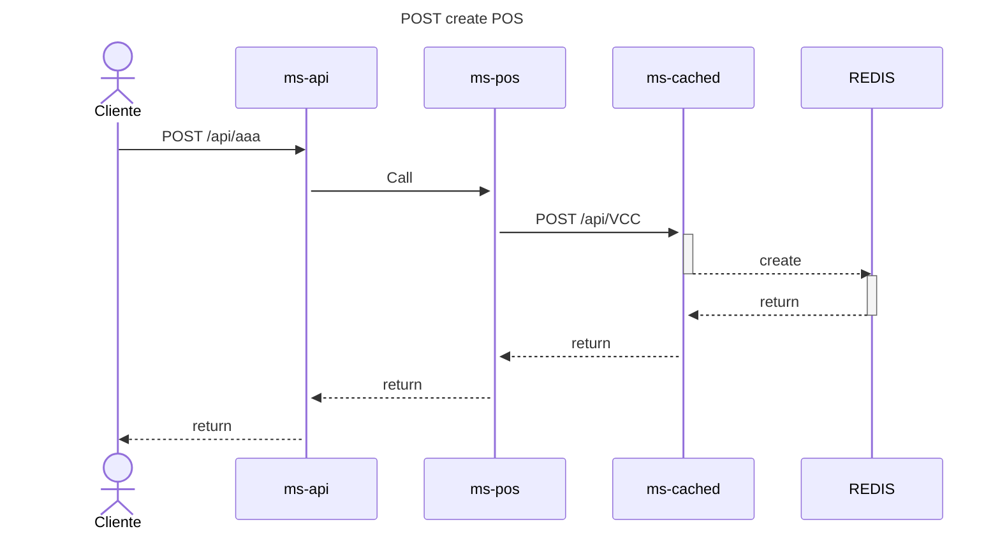

# Challenge Java (Docker Compose | Helm)

Resumen breve
- Este repositorio contiene dos formas de ejecutar la solución:
    1. Docker Compose (archivo `docker-compose.yml` + `.env`) — ejecución local con Docker.
    2. Helm (carpeta `helm`) — desplegar en Kubernetes (Minikube se utiliza de ejemplo).
       helm upgrade challenge-release ./helm/helm
## Docker
Prerrequisitos
- Docker (y Docker Compose)

Estructura
- docker-compose.yml
- .env (variables de entorno usadas por docker-compose)
- Dockerfile por ARG declarando servicio 
- README.md (este archivo)

Ejecutar con Docker Compose
1. Crear `.env` (ejemplo mínimo):
    ```
    LOCAL_PORT: 8768
    POSTGRES_DB: MQDB
    POSTGRES_PASSWORD: Password
    POSTGRES_USER: Username
    DOCKER_PORT: 8088
    REDIS_PASSWORD: Password
    HOST_POS: pos
    HOST_DATA: data
    HOST_CACHE: cache
    REDIS_HOST: cacheRedis
    ```
2. Construir imágenes (si aplica):
    - podman compose -f compose.yaml up --build redis -d
    - podman compose -f compose.yaml up --build db -d
3. Levantar servicios:
     - docker-compose up -d --build
   - podman compose -f compose.yaml up --build -d
4. Ver logs parar:
     - docker-compose logs -f
5. Parar
     - docker-compose down -v

Notas Docker Compose

- Se usan volúmenes para persistencia de PostgreSQL.
- Variables sensibles (contraseñas) se colocan `.env`

## Helm

### Prerrequisitos
- Docker
- Minikube
- kubectl
- Helm 3

### Estructura

- helm/
    - Chart.yaml
    - values.yaml
    - templates/...
- Dockerfile por ARG declarando servicio
- README.md (este archivo)


### Ejecutar con Helm en Minikube
1. Instalar 
    - Minikube
    - Docker (O podman)
    - Helm
2. Iniciar Minikube:
    - minikube start
3. Activar Addons
    - minikube addons enable ingress
4. Instalar el chart:
    - helm install challenge-release ./helm/helm
5. Actualizar el chat
    - helm upgrade challenge-release ./helm/helm
6. Activar el tunnel Minikube
    - minikube tunnel
7. Ver estado:
    - kubectl get pods -n default
    - kubectl get svc -n default

Notas Helm
- values.yaml contiene imágenes, recursos, persistencia y configuración de Redis / Postgres.
- Secrets y ConfigMaps se declaran como recursos en templates/ para inyectar variables en runtime.
- Se Habilitan persistence (PVC) para Postgres y Redis.


## Diseño de arquitectura y decisiones técnicas
- Microservicios:
    - Cada servicio es responsable de su dominio y sus datos (Recomendado: base de datos por servicio).
    - Comunicación: HTTP/REST o eventos (si aplica).
- WebFlux / Reactivo:
    - Backend implementado con Spring WebFlux (non-blocking) para alto rendimiento y manejo eficiente de conexiones.
  - Uso de programación reactiva (Flux/Mono) en capas de controlador, servicio y repositorio (cuando sea compatible).
- MVC vs Reactivo:
    - MVC clásico (Spring MVC) es bloqueante; WebFlux mantiene separación de responsabilidades (controlador → servicio →
      repositorio) pero con tipos reactivos.
    - Controladores reaccionan a flujos de datos (no a hilos bloqueantes).
- RedisReactivo:
    - Redis usado como cache reactivo o pub/sub con cliente reactivo (lettuce/reactor).
    - Interacciones no bloqueantes para mantener la cadena reactiva.
- PostgreSQL:
    - Persistencia relacional; usar R2DBC si se desea acceso reactivo a Postgres.
    - Transacciones y consultas complejas siguen en la capa de persistencia.
- DRY (Don't Repeat Yourself)
  DRY: extraer lógica común en utilidades/services compartidos o librerías internas.
- SOLID:
    - Single Responsibility (controladores ligeros)
    - Open/Closed (extensibilidad)
    - Dependency Injection (inversión de dependencias)
    - interfaces para repositorios, etc.

Principios asociados y su aplicación
- Escalabilidad: microservicios + Docker/Helm permiten escalar por servicio; WebFlux mejora concurrencia.
- Resiliencia: circuit breakers, timeouts, retries; separación de responsabilidades ayuda a aislar fallos.
- Observabilidad: health endpoints, métricas (Prometheus), logs centralizados (EFK/ELK).
- Seguridad: gestión de secretos en Kubernetes (Secrets), TLS para servicios, validar inputs y aplicar roles.
- Mantenibilidad: aplicar SOLID/DRY, tests unitarios y de integración, CI/CD para builds y despliegues.

## POS POST



## POS PUT


## POS DELETE


## POS GET


## POSCOST POST


## POSCOST PUT


## POSCOST DELETE


## POSCOST GET


